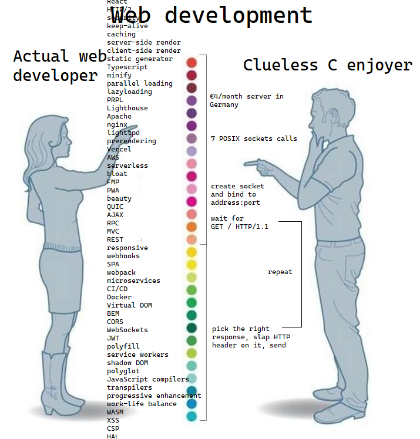

## Cleaning
    on arch https://averagelinuxuser.com/clean-arch-linux/


# Tips
Pass files from PC to notebook

On notebook find ip

    ip addr show

Then

    rsync $HOME/path/to/file/pc user@ip:/path/to/file/notebook

Keyboard

    https://isamert.net/2020/05/30/better-keyboard-experience-in-linux.html

Posix Shell

    https://pubs.opengroup.org/onlinepubs/9699919799/utilities/V3_chap02.html#tag_18

Dash

    ln -sfT dash /usr/bin/sh
    https://www.baeldung.com/linux/test-posix-compliance-shell-scripts

Login Shells

    https://linuxhandbook.com/login-shell/

    echo $0 # If starts with - then it's a login shell

## lifetime-config-files

    vim /etc/systemd/system/getty@tty1.service.d/autologin.conf

## Wayland


```bash
sudo apt-get install -y nala
sudo nala install -y meson wget build-essential ninja-build cmake-extras cmake gettext gettext-base fontconfig libfontconfig-dev libffi-dev libxml2-dev libdrm-dev libxkbcommon-x11-dev libxkbregistry-dev libxkbcommon-dev libpixman-1-dev libudev-dev libseat-dev seatd libxcb-dri3-dev libvulkan-dev libvulkan-volk-dev  vulkan-validationlayers-dev libvkfft-dev libgulkan-dev libegl-dev libgles2 libegl1-mesa-dev glslang-tools libinput-bin libinput-dev libxcb-composite0-dev libavutil-dev libavcodec-dev libavformat-dev libxcb-ewmh2 libxcb-ewmh-dev libxcb-present-dev libxcb-icccm4-dev libxcb-render-util0-dev libxcb-res0-dev libxcb-xinput-dev libpango1.0-dev xdg-desktop-portal-wlr hwdata-dev

mkdir HyprSource
cd HyprSource
```

## We get Source
wget https://github.com/hyprwm/Hyprland/releases/download/v0.24.1/source-v0.24.1.tar.gz
tar -xvf source-v0.24.1.tar.gz
wget https://gitlab.freedesktop.org/wayland/wayland-protocols/-/releases/1.31/downloads/wayland-protocols-1.31.tar.xz
tar -xvJf wayland-protocols-1.31.tar.xz

wget https://gitlab.freedesktop.org/wayland/wayland/-/releases/1.22.0/downloads/wayland-1.22.0.tar.xz
tar -xzvJf wayland-1.22.0.tar.xz

wget https://gitlab.freedesktop.org/emersion/libdisplay-info/-/releases/0.1.1/downloads/libdisplay-info-0.1.1.tar.xz
tar -xvJf libdisplay-info-0.1.1.tar.xz

# github

Get Token
The first step in using tokens is to generate a token from the GitHub website. Note that it would be best practice to use different tokens for different computers/systems/services/tasks so that they can be easily managed.

To generate a token:

Log into GitHub
Click on your name / Avatar in the upper right corner and select Settings
On the left, click Developer settings
Select Personal access tokens and click Generate new token
Give the token a description/name and select the scope of the token
I selected repo only to facilitate pull, push, clone, and commit actions
Click the link Red more about OAuth scopes for details about the permission sets
Click Generate token
Copy the token – this is your new password!

Configure local GIT
Once we have a token, we need to configure the local GIT client with a username and email address. On a Linux machine, use the following commands to configure this, replacing the values in the brackets with your username and email.

git config --global user.name ""
git config --global user.email ""
git config -l
Clone from GitHub
Once GIT is configured, we can begin using it to access GitHub. In this example I perform a git clone command to copy a repository to the local computer. When prompted for the username and password, enter your GitHub username and the previously generated token as the password.


Configure Credential Caching
Lastly, to ensure the local computer remembers the token, we can enable caching of the credentials. This configures the computer to remember the complex token so that we dont have too.

git config --global credential.helper cache

export GCM_CREDENTIAL_CACHE_OPTIONS="--timeout 300"
# or
git config --global credential.cacheOptions "--timeout 300"
git config --global credential.credentialStore cacheclear the token from the local computer by running

git config --global --unset credential.helper

# WSL

### xorg
- donwload ``GWSL`` from microsoft store optionally ``X410``
- donwload Arch.zip from ``https://github.com/yuk7/ArchWSL``
- follow this guide ``https://wsldl-pg.github.io/ArchW-docs/How-to-Setup/#initialize-keyring``
### pacman
- [user@PC-NAME]$ sudo pacman-key --init

- [user@PC-NAME]$ sudo pacman-key --populate

- [user@PC-NAME]$ sudo pacman -Sy archlinux-keyring

- [user@PC-NAME]$ sudo pacman -Su
- sudo pacman -S --needed base-devel

- sudo pacman -S archlinux-keyring && sudo pacman -Syu
- edit /etc/pacman.conf, add "ParallelDonwloads = 5"
- yay -S ttf-jetbrains-mono-nerd 3.0.2-1
- power level10k, and change to zsh
### shell 
- yay -S --noconfirm zsh
- yay -S --noconfirm zsh-theme-powerlevel10k-git
- echo 'source /usr/share/zsh-theme-powerlevel10k/powerlevel10k.zsh-theme' >>~/.zshrc
- chsh -s /usr/bin/zsh
- git clone https://github.com/zsh-users/zsh-autosuggestions ~/.zsh/zsh-autosuggestions
- yay -S exa
- ps -p $$ check your shell with
### display manager (dont)
### xorg
- sudo pacman -S --noconfirm xorg

# Vim tips
- :g/<!-- [A-Z]\+[0-9]\+/norm $da<0P
- :read !ls *pdf
- https://duckduckgo.com/?q=vim+go+to+end+of+single+row+wrap&atb=v387-7rc&ia=web

# USB / WIFI
- rfkill, to see if is blocked on a hardware level
- iwctl to connect to wifi
- nmtui also
- lspci -k
- lsusb
- lspci -vnn

# xkb
- read https://unix.stackexchange.com/questions/65507/use-setxkbmap-to-swap-the-left-shift-and-left-control/65600#65600
- https://unix.stackexchange.com/questions/75473/how-to-prevent-the-caps-lock-toggle-effect-without-remapping-or-disabling-it
- https://unix.stackexchange.com/questions/65507/use-setxkbmap-to-swap-the-left-shift-and-left-control/65600#65600 
- https://web.archive.org/web/20170825051821/http://madduck.net/docs/extending-xkb/

# X11:
## BWSP
- https://github.com/rxyhn/tokyo
# Wayland:
- setup dwl https://www.youtube.com/watch?v=yjVVVAdK4-Y&list=TLPQMDEwODIwMjOjLrpVZxBuaQ&index=3   https://www.youtube.com/watch?v=Tk0BWygZEgM&list=TLPQMDEwODIwMjOjLrpVZxBuaQ&index=1&pp=gAQBiAQB 
- really good setup with win10 virtualized https://www.youtube.com/watch?v=wNL6eIoksd8 guide https://christitus.com/my-new-desktop-hyprland/
- comparing 'compositors' make any window a scratcpad (<- that's cool) https://www.youtube.com/watch?v=NfDPP67ZqhQ&t=1s
- dots from video above https://github.com/Babkock/Dotfiles
- look at them bars https://wiki.hyprland.org/Useful-Utilities/Status-Bars/

## Hyperland
- https://lib.rs/crates/hyprscratch
- https://github.com/SolDoesTech/hyprland
- get waybard config https://github.com/BrodieRobertson/dotfiles
- vertical bar https://github.com/elkowar/eww  https://github.com/rxyhn/tokyo
- https://github.com/adi1090x/polybar-themes

# XDG
- https://specifications.freedesktop.org/basedir-spec/basedir-spec-latest.html

# Debuggers
- https://github.com/epasveer/seer/wiki/Building-Seer---Qt6
- https://www.gnu.org/software/ddd/
- https://github.com/longld/peda


